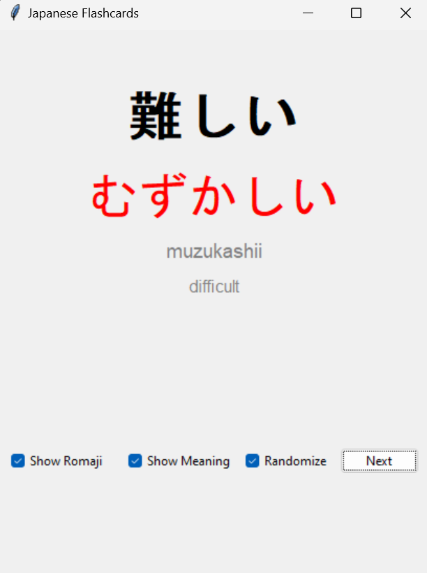
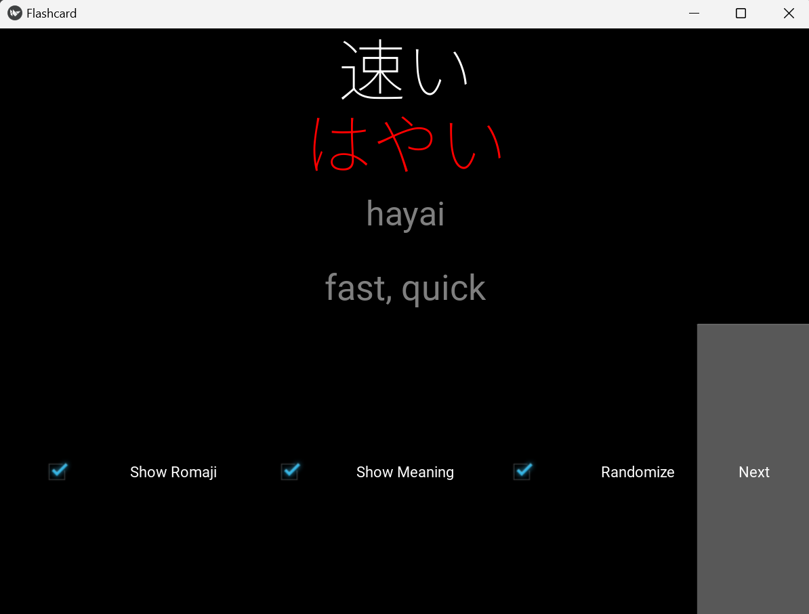

# Random_JLPT_N5_Vocab_Flashcards
A simple Python Flashcard application to generate random Japanese N5 vocabulary words.
There are two UI implementations,

1) Using tkinter.
 - Can show the Kanji.
 - Can show/hide the meaning and romaji.
 - Option to randomize the words.

2) Using Kivy.
 - Can show the Kanji.
 - Can show/hide the meaning and romaji.
 - Option to randomize the words.

